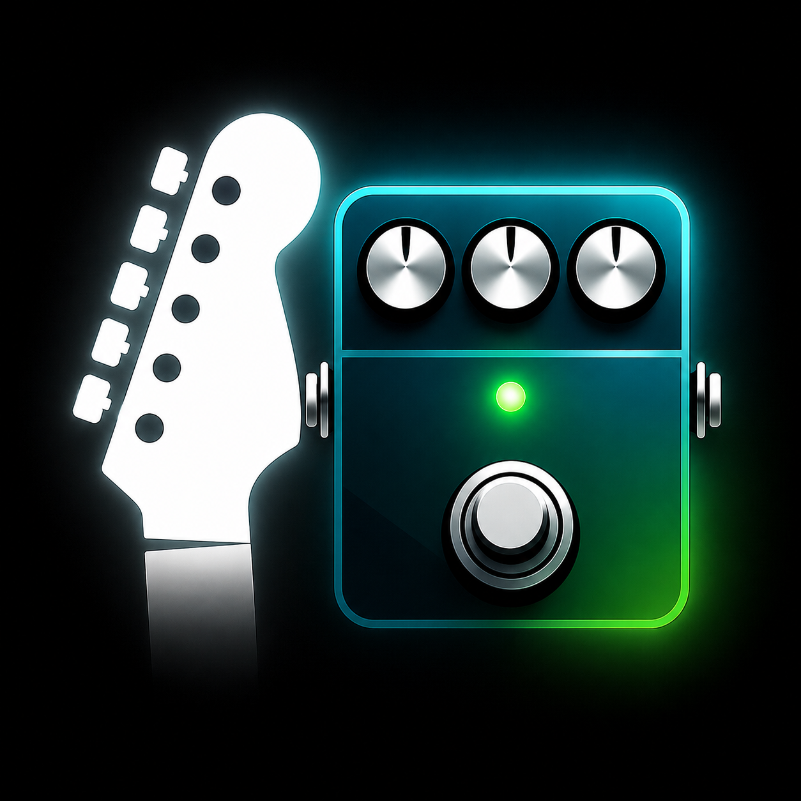

  

<h1 align="center">SmartPedal</h1>

  <b>A customizable digital guitar pedal platform using Qt Quick and ESP32</b>

O código desenvolvido nesse projeto é referente à matéria ELE64 - Oficina de Integração, ministrada pelo professor Cesar Manuel Vargas Benitez.
Inclui o código do aplicativo desenvolvido para celular, que controla os efeitos e os envia para a pedaleira.